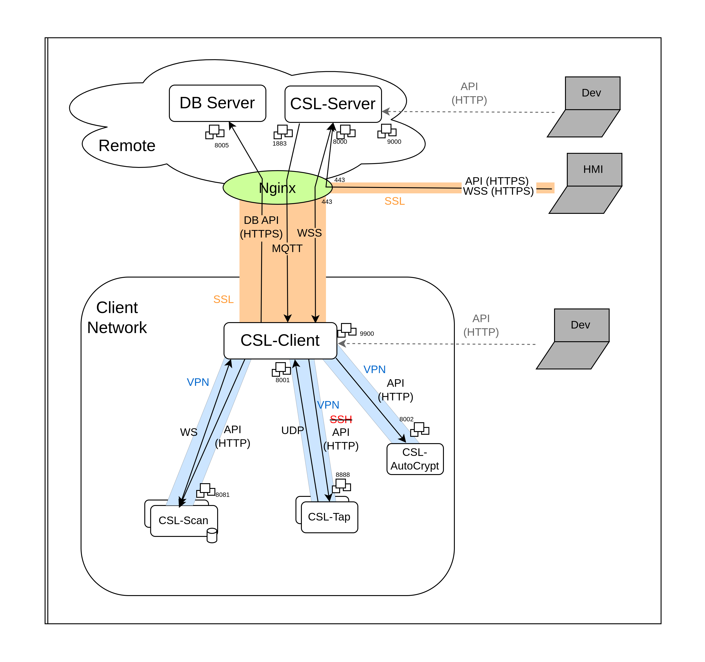

# Connexions
The different elements of the project and the connexions between them:
- Database Remote Server
- CSL-Server : remote
- CSL-Client : installed in the client network. It plays the role of concentrator and forwarder.
- Module CSL-Scan : installed in the client network.
- Module CSL-Probe : installed in the client network.

NOTE : The API HTTP of CSL-Client is only for develop, it has the same endpoints that the Secured API from CSL-Server.

NOTE : The connexion to CSL-Probe was made through SSH, but it will be changed to an API secured with a VPN.

## MQTT:
**Description**: protocol for message queue/message queuing service. This socket is used to send notifications
from CSL-Server to CSL-Client, which may trigger some actions at CSL-Client. However, the important data is not sent
through the MQTT socket but through the WSS, which are in parallel.
notifications send from CSL-Server to CSL-Client, which may trigger some actions at CSL-Client.

**Architecture**: CSL-Server plays the role of the server and the CSL-Client is the client.
However, the notifications are sent from the CSL-Server to the CSL-Client.

**Package** : `com.csl.intercom.broker`

**Initialisation trace at MainClient** :
`CSLIDSMainClient →
JServiceLoader.registerService →
DiscoveryService.init → mqttBroker.subscribeToTopic`

**Initialisation trace at MainServer** :
`CSLIDSMainServer → CSLContext.instance.postInit → CSLHTTPServer.initServer(JSON) →
CSLHTTPServer.initServer(ServerConfig) → WebSocket.registerAll →
JServiceLoader.getCSLInterModuleCommunicationManager →
CSLInterModuleCommunicationManager → SocketMessageMQTTHandler`

## WSS:
**Description**: web socket secured by the SSL layer (need of a valid API key). This socket is used to communicate all
important information between the CSL-Server and CSL-Client. This is the main channel of communication between the remote
CSL-Server and the CSL-Client, placed into the client network.

**Architecture**: CSL-Server plays the role of the server and the CSL-Client is the client.
However, the communication is bidirectional.

**Package** : `com.csl.web.websockets`, `main.xcom`

**Initialisation trace at MainClient** :
`CSLIDSMainClient → CSLIDSMainClient.startRemoteConnectTask →
CSLIDSMainClient.connectToServer → WebsocketClientEndpoint`

**Initialisation trace at MainServer** :
`CSLIDSMainServer → CSLContext.instance.init →
CSLHttpServer`

## Secured API:
**Description**: API Rest of the Database exposed to the CSL-(TODO : Client or Server).
This type of connexion is also used for exposing the public API from CSL-Server to the HMI.

**Architecture**: Database Remote Server is the server of the API. CSL-Server is the server
for the public API.

**Package** : `com.csl.web.database`, `com.csl.web.websockets`, `com.csl.intercom.dbapi`

**Initialisation trace at MainClient** :
Not used.

**Initialisation trace at MainServer** :
`CSLIDSMainServer → ApiHttpServer().createServer`

## API:
**Description**: API Rest of a module (CSL-Scan, CSL-Probe). It is exposed to the CSL-Client, which interacts via
HTTP requests. Each module has an API which allows part of the communication between CSL-Client and the corresponding
module. These HTTP connexions are secured with a VPN.

**Architecture**: modules are the servers and CSL-Client is the client of all of them.

**Package** : `com.csl.intercom.cslscan`

**Initialisation trace at MainClient** :
`CSLIDSMainClient →
JServiceLoader.registerService →
DiscoveryService.init → ScanAPIHandler`

**Initialisation trace at MainServer** :
Not used

## WS:
**Description**: web socket for the communication between the CSL-Client and some modules (CSL-Scan). Each of these
sockets allows part of the communication between CSL-Client and the corresponding module. These HTTP
connexions are secured with a VPN.

**Architecture**: modules are the servers and CSL-Client is the client of all of them.

**Package** : `com.csl.intercom.cslscan`

**Initialisation trace at MainClient** :
`CSLIDSMainClient →
JServiceLoader.registerService →
DiscoveryService.init → ScanWebSocketHandler`

**Initialisation trace at MainServer** :
Not used

## UDP:
**Description**: protocol to forward the notifications from CSL-Probe to the socket in the case of the CSL-Client.
and to (TODO : ?) in the case of CSL-Server. The received messages are stored into a queue by a listening thread and
managed by another thread that reads the queue.

**Architecture**: CSL-Client is the server side to module (CSL-Probe). CSL-Server plays the role for client side
to the HMI. Between the CSL-Client and CSL-Server messages are channeled through the WSS.

**Package** : `com.csl.alert`, `com.csl.udp`, `com.csl.web`, `com.csl.modules`, `com.wcls.ids`

**Initialisation trace at MainClient** :
`CSLIDSMainClient → CSLContext.instance.postInit → CSLUDPServer.initUDPServer`

**Initialisation trace at MainServer**
`CSLIDSMainServer → CSLContext.instance.init → CSLAlertManager -- CSLAlertManager.sendAlertToViewerUDP`

## SSH:
**Description**: protocol for operating network services securely over an unsecured network. This will be changed by a
VPN that will secure the network.

**Architecture**: Suricata IDS is the server and CSL-Client is the client.

**Package** : `main.extensions.SshUtils`

**Initialisation trace at MainClient** :
Not used. Initialize at every command

**Initialisation trace at MainServer**
Not used. Initialize at every command

## Unix Socket:
**Description**: protocol to communicate in the same machine. This is used in CSL-Probe, between the Suricata IDS
and the manager.

**Architecture**: Suricata IDS is the server for the Command's socket, but it's the client for the alert socket.
The manager is the client for the commands and the server for the alerts.

**Package** : Not used

**Initialisation trace at MainClient** :
Not used

**Initialisation trace at MainServer**
Not used

