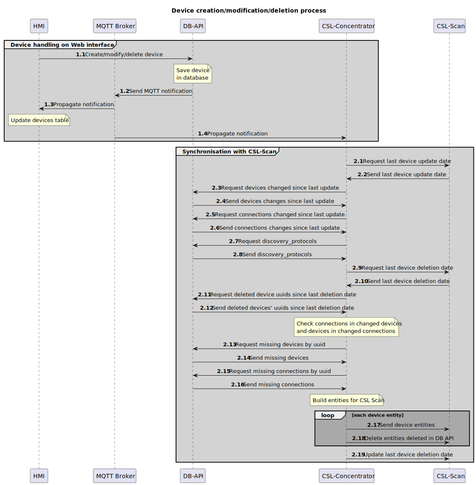

# Device Synchronization

## Table of Contents
1. [Introduction](#introduction)
2. [Device Handling on Web Interface](#device-handling-on-web-interface)
3. [Synchronisation with CSL-Scan](#synchronisation-with-csl-scan)
4. [Device Entity Management](#device-entity-management)
5. [Conclusion](#conclusion)

## Introduction
This document outlines the process for creating, modifying, and deleting devices through a web interface. The workflow is presented in a visual format to enhance understanding of the interactions between different components, including the HMI (Human-Machine Interface), MQTT Broker, and database interactions. The flowchart also details the synchronization procedure with the CSL-Scan system for up-to-date information about devices.

## Device Handling on Web Interface
The device handling process involves several key steps:

1. **Create/Modify/Delete Device** (1.1)
   - The initial actions taken on the web interface to manage devices.

2. **Save Device in Database** (1.1)
   - After a device is created or modified, it is saved to a database.

3. **Send MQTT Notification** (1.2)
   - Once a device is modified, a notification is sent via MQTT (Message Queuing Telemetry Transport) to inform other systems.

4. **Propagate Notification** (1.3)
   - Notifications are propagated to other services, indicating a change in the device's status.

5. **Update Devices Table** (1.4)
   - The devices table is updated to reflect the changes made to the devices.

This section emphasizes the interactivity of device management, showcasing how user actions on the web interface trigger specific backend processes and notifications.

## Synchronisation with CSL-Scan
This part of the document focuses on synchronizing device information with the CSL-Scan system, which is essential for maintaining consistency across platforms. The steps include:

1. **Request Last Device Update Date** (2.1)
   - The system requests the most recent update date for devices from the CSL-Scan.

2. **Send Last Device Update Date** (2.2)
   - This information is then sent back to the requesting system.

3. **Request Devices Changed Since Last Update** (2.3)
   - The system queries for any devices that have been modified since the last update.

4. **Send Device Changes Since Last Update** (2.4)
   - Any changes detected are sent back to the requesting system.

This section provides insight into the integration with CSL-Scan, showcasing the data consistency efforts and the importance of regular updates.

## Device Entity Management
Finally, the device entity management section explains how individual device entities are handled within the context of the application. Key steps include:

1. **Build Entities for CSL Scan** (2.17)
   - After the updates and changes have been propagated, entities corresponding to each device are built for uniformity in the CSL Scan.

2. **Loop through Each Device Entity** (loop)
   - A loop processes each device entity, performing necessary updates or actions according to the system's requirements.

## Conclusion
This documentation provides a comprehensive overview of the device creation, modification, and deletion process along with synchronization with the CSL-Scan system. The workflow highlights the interdependencies between components and the mechanisms for ensuring accurate and timely updates across platforms. By understanding this process, stakeholders can better manage device information and response, ensuring a robust system architecture that is efficient and effective in handling device data.