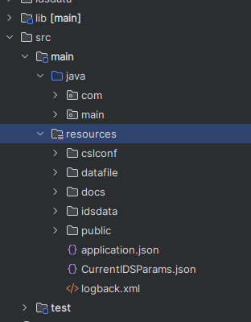
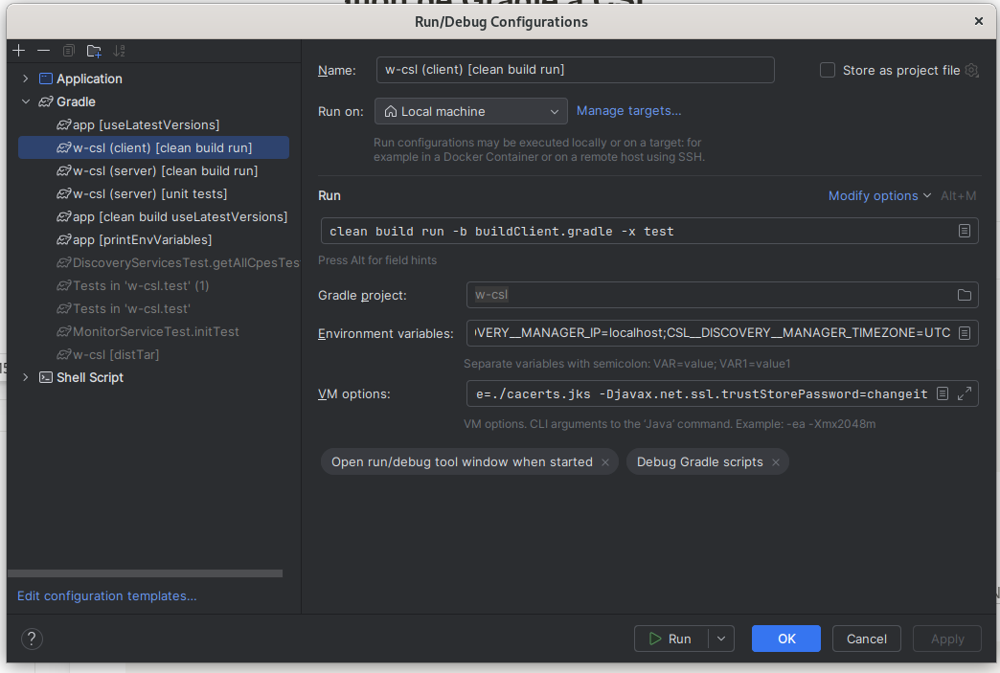
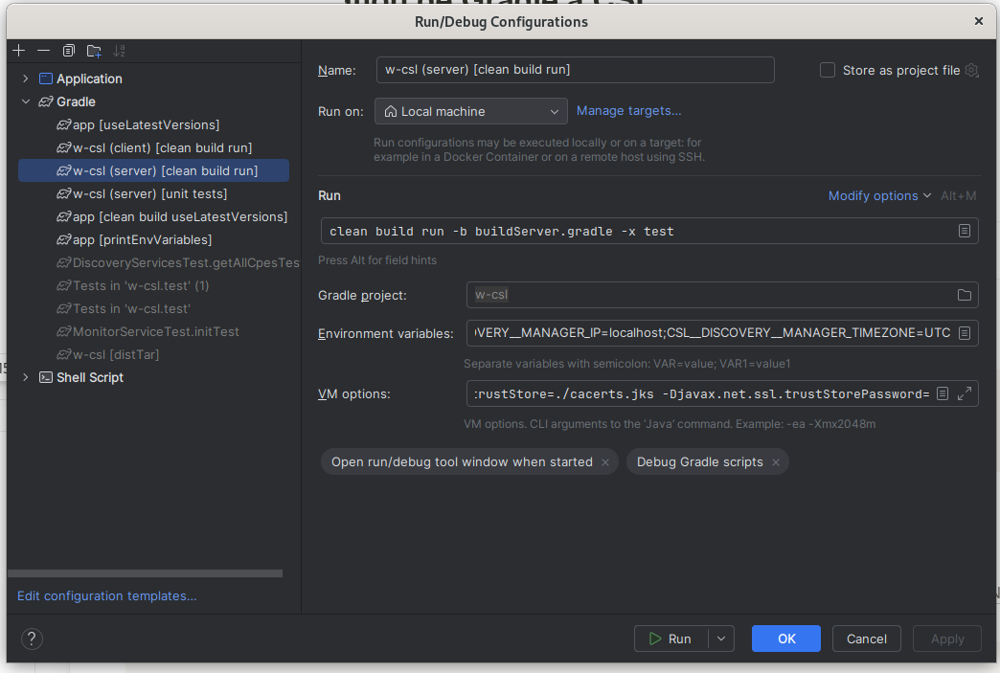

# Guide d’intégration de Gradle à CSL

Type: Article
Tags: Gradle

### Partie 1 : Créer une copie de la branche souhaitée

```bash
git checkout <branche souhaitee>
git checkout -b <nouvelle branche>
```

### Partie 2 : Initialisation de Gradle

1. Suivre le guide d’installation de Gradle

[https://gradle.org/install/?_gl=1*1sf217q*_ga*MTQ0NTg3NTM3Ni4xNzE2MzA1NTU3*_ga_7W7NC6YNPT*MTcxNjQ3MzMxMy41LjEuMTcxNjQ3MzM4Ni42MC4wLjA](https://gradle.org/install/?_gl=1*1sf217q*_ga*MTQ0NTg3NTM3Ni4xNzE2MzA1NTU3*_ga_7W7NC6YNPT*MTcxNjQ3MzMxMy41LjEuMTcxNjQ3MzM4Ni42MC4wLjA).

b. Lancer la commande d’initialisation à la racine du projet : gradle init , puis répondre aux questions comme suit :

```bash
Select type of build to generate:
  1: Application
  2: Library
  3: Gradle plugin
  4: Basic (build structure only)
Enter selection (default: Application) [1..4] 1

Select implementation language:
  1: Java
  2: Kotlin
  3: Groovy
  4: Scala
  5: C++
  6: Swift
Enter selection (default: Java) [1..6] 1

Enter target Java version (min: 7, default: 21): 11

Project name (default: w-csl): 

Select application structure:
  1: Single application project
  2: Application and library project
Enter selection (default: Single application project) [1..2] 1

Select build script DSL:
  1: Kotlin
  2: Groovy
Enter selection (default: Kotlin) [1..2] 2

Select test framework:
  1: JUnit 4
  2: TestNG
  3: Spock
  4: JUnit Jupiter
Enter selection (default: JUnit Jupiter) [1..4] 1
```

*Si vous vous êtes trompés dans l'initialisation, il vous suffit de supprimer tous les fichiers ajoutés par Gradle et relancez la commande.*

### Partie 3 : Re-factoriser les dossiers

1. **Déplacer les packages et les fichiers sources**

Graddle a crée à la racine un dossier `App`. En laissant les librairies de cotés, il faut répartir les fichiers dans les dossiers qui leurs correspondent. Vous pouvez voir un exemple d'architecture en annexe.



b. **Déplacer les librairies**

Pour éviter de faire des noeuds, je gère le remplacement des dépendances des libraries très progressivement. Si des étapes vous semblent peu utile, n’hésitez pas à les sauter.

1. Créer 2 dossiers dans le dossier lib à la racine du projet : unpacked, y déplacer les librairies dépaquetées et jar, y déplacer les librairies sous .jar
2. Déplacer le dossier unpacked la partie main/java , et .jar dans la partie main/ressources

### Partie 4 : Configuration de Gradle

1. **Configurer les fichiers de build**

Automatiquement Gradle génère 2 types de fichiers :

- **settings.gradle** : spécifiant le nom du module ou sous module reconnu par gradle à la compilation. En général nous avons pas besoin de le toucher.
- **build.gradle** : fichier contenant toutes les dépendances nécessaires au projet + d’autres éléments de configuration. C’est le fichier le plus important ici.

*Sans ces 2 fichiers, Gradle ne pourra pas compiler.*

Le **build.gradle** ne peut run qu’un fichier main, on peut passer par une tâche pour un deuxième main. Mais ici nous avons choisi de séparer la configuration en 3 fichiers de build différents : **build.gradle** qui contiendra les dépendances et configurations communes au main client et serveur, **buildClient.gradle** , **buildServer.gradle** qui lanceront leurs main respectifs

*Il faut donc les créer, vous pouvez voir une exemple de configuration spécifique à W-CSL sous java 11 dans les fichiers annexes à la fin de la page.*
les versions des librairies du dossier sont à adapter + ajouter les librairies dont vous avez besoin. Vous pourrez trouver toutes ces informations sur la page web de mavencentral : https://central.sonatype.com/ .

Maintenant que le **build.gradle** contient tout les liens vers les librairies nous pouvons supprimer la plus part des librairies du dossier .jar sauf xminiserver qui est une librairie faites main. Pareil pour le dossier unpacked, il faut grader la librairie mitre.cpe et nmap4j_csl qui sont des librairies locales.

b. **Configurer l’environnement SSL**

Le fichier **cacerts.jks** doit se trouver dans le répertoire `App`

1. Créer un fichier **properties.gradle**, et y ajouter le code suivant pour réduire le temps de compilation :

```Groovy
org.gradle.caching=true

org.gradle.jvmargs = -Dlogback.configurationFile=./src/main/resources/logback.xml -Djavax.net.ssl.trustStore=./cacerts.jks -Djavax.net.ssl.trustStorePassword=changeit
```
La deuxième commande est neccesaire si cette configuration est déjà faite dans la configuration de IntelliJ.

2. Configurer les run du Main Client et du Main Server comme vous pouvez le voir dans le dossier annexes, avec les mêmes variables globales que celles passées à Gradle. L’option -x test, permet d’ignorer les tests à la compilation





### Annexes

**build.gradle :**

```groovy
/*
 * This file was generated by the Gradle 'init' task.
 *
 * This generated file contains a sample Java application project to get you started.
 * For more details on building Java & JVM projects, please refer to https://docs.gradle.org/8.7/userguide/building_java_projects.html in the Gradle documentation.
 */
apply plugin: 'java'
apply plugin: 'application'
apply plugin : 'jacoco'

repositories {
    // Use Maven Central for resolving dependencies.
    mavenCentral()
}
dependencies {
    //to process lombock annotations while gradle building
    compileOnly 'org.projectlombok:lombok:1.18.32'
    annotationProcessor 'org.projectlombok:lombok:1.18.32'

    //local librairies
    implementation files('src/main/resources/lib/jar/xminiserver.jar')

    //MavenCentral() librairies
    testImplementation 'com.github.tomakehurst:wiremock-jre8:2.31.0'
    testImplementation 'org.mockito:mockito-core:3.12.4'

    implementation 'io.jsonwebtoken:jjwt-api:0.10.0'

    implementation 'com.jcraft:jsch:0.1.55'
    implementation 'org.mindrot:jbcrypt:0.4'
    implementation 'org.projectlombok:lombok:1.18.32'
    implementation 'org.junit.jupiter:junit-jupiter-api:5.11.0-M2'
    implementation 'org.junit.jupiter:junit-jupiter-engine:5.11.0-M2'
    implementation 'org.json:json:20210307'
    implementation 'org.apache.httpcomponents:fluent-hc:4.5.13'
    implementation 'org.jetbrains:annotations:13.0'
    implementation 'org.mongodb:bson:4.2.0'
    implementation 'org.netbeans.external:org-apache-commons-codec:RELEASE190'
    implementation 'org.netbeans.external:org-apache-commons-io:RELEASE113'
    implementation 'org.apache.commons:commons-lang3:3.8.1'
    implementation 'org.netbeans.external:org-apache-commons-logging:RELEASE210'
    implementation 'com.google.code.gson:gson:2.8.6'
    implementation 'org.netbeans.external:com-google-guava:RELEASE113'
    implementation 'org.apache.httpcomponents:httpclient:4.5.12'
    implementation 'org.apache.directory.studio:org.apache.httpcomponents.httpcore:4.1.2'
    implementation 'com.fasterxml.jackson.core:jackson-annotations:2.11.2'
    implementation 'com.fasterxml.jackson.core:jackson-core:2.11.2'
    implementation 'com.fasterxml.jackson.core:jackson-databind:2.11.2'
    implementation 'com.clumd.projects:java-json:1.2.1'
    implementation 'io.javalin:javalin:2.4.0'
    implementation 'org.mindrot:jbcrypt:0.4'
    implementation 'org.eclipse.jetty.aggregate:jetty-all:9.4.14.v20181114'
    implementation 'org.eclipse.jetty:jetty-util:9.4.28.v20200408'
    implementation 'io.jsonwebtoken:jjwt:0.9.1'
    implementation 'com.sun.jna:jna:3.0.9'
    implementation 'jsch:jsch:0.1.7'
    implementation 'org.lightcouch:lightcouch:0.2.0'
    implementation 'ch.qos.logback:logback-classic:1.2.3'
    implementation 'ch.qos.logback:logback-core:1.2.3'
    implementation 'io.micrometer:micrometer-commons:1.10.4'
    implementation 'io.micrometer:micrometer-observation:1.10.4'
    implementation 'org.mongodb:mongo-java-driver:3.12.8'
    implementation 'com.neuronrobotics:nrjavaserial:3.12.1'
    implementation 'org.eclipse.paho:org.eclipse.paho.client.mqttv3:1.2.5'
    implementation 'org.slf4j:slf4j-api:1.7.25'
    implementation 'com.sparkjava:spark-core:2.8.0'
    implementation 'org.springframework:spring-aop:5.2.22.RELEASE'
    implementation 'org.springframework:spring-beans:5.2.22.RELEASE'
    implementation 'org.springframework:spring-context:5.2.22.RELEASE'
    implementation 'org.springframework:spring-core:5.2.22.RELEASE'
    implementation 'org.springframework:spring-expression:5.2.22.RELEASE'
    implementation 'org.springframework:spring-jcl:5.2.22.RELEASE'
    implementation 'org.springframework:spring-messaging:5.2.22.RELEASE'
    implementation 'org.springframework:spring-web:5.2.22.RELEASE'
    implementation 'org.springframework:spring-websocket:5.2.22.RELEASE'
    implementation 'org.apache.servicemix.bundles:org.apache.servicemix.bundles.velocity:1.7_6'
    implementation 'org.jetbrains:annotations:13.0'
}
// Apply a specific Java toolchain to ease working on different environments.
java {
    toolchain {
        languageVersion = JavaLanguageVersion.of(11)
    }
}
run{
    systemProperty 'logback.configurationFile', './src/main/resources/logback.xml'
    systemProperty 'javax.net.ssl.trustStore', './cacerts.jks'
    systemProperty 'javax.net.ssl.trustStorePassword', 'changeit'
}
sourceSets{
    main{
        java{
            srcDirs 'lib/unpacked'
        }
    }
}
test{
    useJUnitPlatform()
    onlyIf {
        !project.hasProperty('test.skip') || !project.getProperty('test.skip').toBoolean()
    }
}
jacocoTestReport {
    dependsOn test
    reports {
        xml.required = true
        csv.required = false
        html.outputLocation = layout.buildDirectory.dir('jacocoHtml')
    }
}

task printEnvVariables {
    doLast {
        println "JAVA_HOME: ${System.getenv('JAVA_HOME')}"
    }
}
```

**buildClient.gradle et buildServer.gradle**

```groovy
plugins{
    id 'java'
    id 'application'
}

apply from : 'build.gradle'

application {
    mainClass = 'main.CSLIDSMainClient' //CSLIDSMainServer
}
```