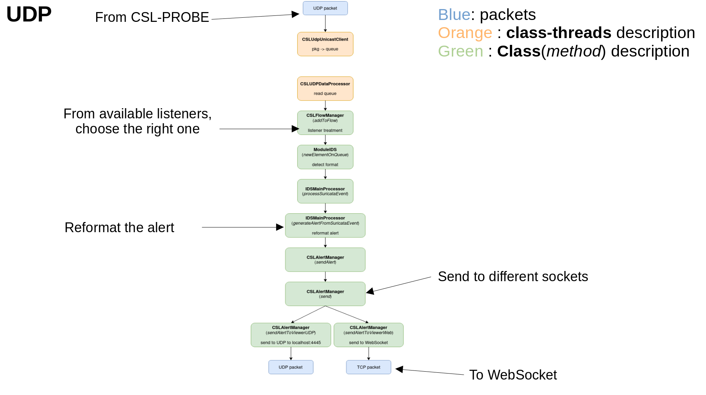
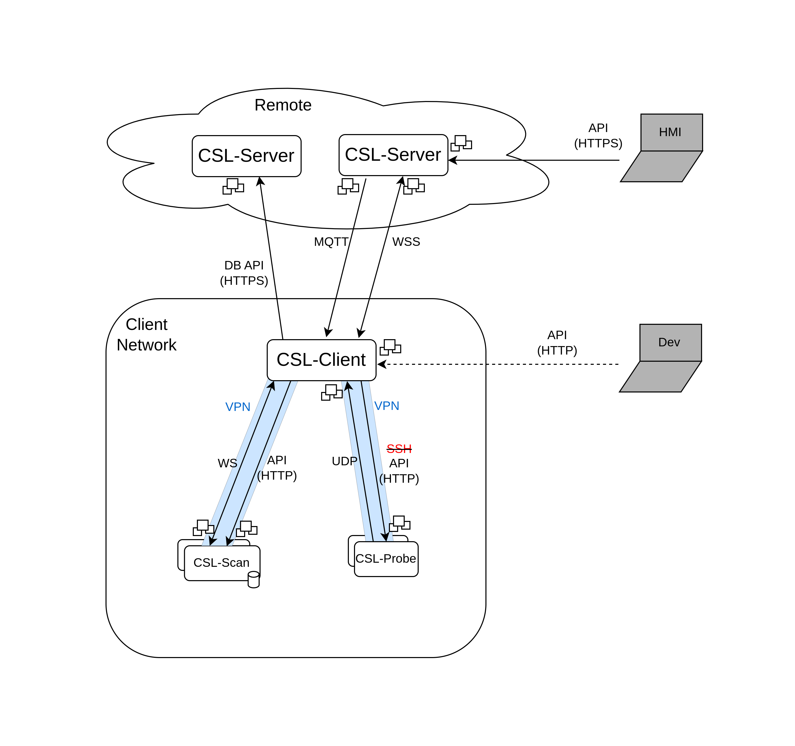

# Table of contents
1. [Getting started](#getting-started)
    1. [CSL-installer](#1-csl-installer)
    2. [CSL-W](#2-csl-w-client-and-server)
   3. [Check connexion](#3-check-connexion)
   4. [Configure IntelliJ](#4-configure-intellij)
   5. [Run the client](#5-run-the-client)
2. [Organisation of project](#organisation-of-project)
3. [Code organisation](#code-organisation)
    1. [com](#--scr--com)
    2. [io.jsonwebtoken](#--src--iojsonwebtoken)
    3. [ipublic](#--src--ipublic)
    4. [main](#--src--main)
    5. [org](#--src--org)
    6. [spark](#--src--spark)
4. [Services](#services)
    1. [Alerts](#alert-service)
    2. [CPE](#cpe-service)
   3. [Demo](#demo-service)
   4. [IDS](#ids-service)
   5. [CVE](#cve-service)
   6. [Discovery](#discovery-service)
   7. [Monitor](#monitor-service)
   8. [Nmap](#nmap-service)
   9. [Status](#status-service)
   10. [Suricata](#suricata-service)
   11. [Taps](#taps-service)
5. [Connexions](#connexions)
   1. [MQTT](#mqtt)
   2. [Secured Web Socket](#wss)
   3. [DB Secured API](#secured-api)
   4. [API](#api)
   5. [Web Socket](#ws)
   6. [UDP](#udp)
   7. [Unix sockets](#unix-socket)
6. [Modules](#modules)
   1. [CSL-Scan](#csl-scan)
   2. [CSL-Probe](#csl-probe)
----

# Getting started

### 1 CSL-installer
In `CSL-installer` project:
```bash
$ .setup.sh
....
Do you want to login using you username/token [Y/n]  # Y (first time, n to keep previous login)
...
Should CSL create a self-signed certificate ? [y/N]  # y to create a new self-signed certificate
...
Download CPE/CVE database? [Y/n] # not necessary
...
Creating the api key ...
API KEY -5iP5HtAE.Z4s3SgsYUJPazCM7XbRyBAq3bXCzXHVG- has been created   # API key to save : 5iP5HtAE.Z4s3SgsYUJPazCM7XbRyBAq3bXCzXHVG
The environment variables file for csl client is created in csl_client.env
...
Tap`s name [tap01]: # Enter to have the default name
```

### 2 CSL-W (client and server)
In the `w-csl` project, we need to store the certificate. We need first to add the right path to the certificate file,
in my case : `CERT_FILE=../csl-installer/config/nginx/certs/csl_hmi.crt`
```bash
$ nano ./create_certificate_store.sh
```
Now we can just execute the script:
```bash
$ ./create_certificate_store.sh   # may need change if computer in other language that english
```

### 3 Check connexion
Now we can verify that everything runs as excepted ( the API key is ok):
```bash
$ docker logs -f csl_client
```
This logs may contain errors due to missing modules or db.
We should just check that we are connected to the server:
```bash
...
main.CSLIDSMainClient: Connected to server
...
```

### 4 Configure IntelliJ
This is an old Eclipse project, so we need to download the JDK Temurin v11 at:

`Project Structure > Project Settings > Project > SDK > Download JDK`

Now lets configure the run/debug configuration:
- Create a new Application configuration (plus in the top right)
- Name it
- Select the SDK java 11
- Choose the main class : main.CSLIDSMainClient for the client
- add the following environment variables:
```
CSL.ALERT_VIEWER.IP=localhost
CSL.DISCOVERY.MANAGER_IP=localhost
CSL.DISCOVERY.MANAGER_PROTOCOL=http
CSL.DISCOVERY.MANAGER_TIMEZONE=UTC
CSL.GLOBAL.API_KEY=5iP5HtAE.Z4s3SgsYUJPazCM7XbRyBAq3bXCzXHVG  # the API key saved above
CSL.GLOBAL.FORCE_HOST_NAME_RESOLUTION=true
CSL.GLOBAL.IP_SERVER_REMOTE=localhost
CSL.GLOBAL.LAUNCH_WEB_API_SERVER=true
CSL.GLOBAL.PORT_SERVER_REMOTE=0
CSL.GLOBAL.SERVER_REMOTE_URL_PREFIX=/jws
CSL.GLOBAL.USE_SSL=true
CSL.IDS_CONF.HISTORY_LENGTH=60
```
or copy and paste
```
CSL.ALERT_VIEWER.IP=localhost;CSL.DISCOVERY.MANAGER_IP=localhost;CSL.DISCOVERY.MANAGER_PROTOCOL=http;CSL.DISCOVERY.MANAGER_TIMEZONE=UTC;CSL.GLOBAL.API_KEY=5iP5HtAE.Z4s3SgsYUJPazCM7XbRyBAq3bXCzXHVG;CSL.GLOBAL.FORCE_HOST_NAME_RESOLUTION=true;CSL.GLOBAL.IP_SERVER_REMOTE=localhost;CSL.GLOBAL.LAUNCH_WEB_API_SERVER=true;CSL.GLOBAL.PORT_SERVER_REMOTE=0;CSL.GLOBAL.SERVER_REMOTE_URL_PREFIX=/jws;CSL.GLOBAL.USE_SSL=true;CSL.IDS_CONF.HISTORY_LENGTH=60
```
Before continue, change the API key with the new one created above.

Last thing, add some options to the execution:

`Modify options > Add VM options`

and copy-paste:
```
-Dlogback.configurationFile=resources/logback.xml
-Djavax.net.ssl.trustStore=./cacerts.jks
-Djavax.net.ssl.trustStorePassword=changeit
```

### 5 Run the client
For instance, we will run the client out of the container:
```
docker stop csl_client
```
It may take several seconds to stop. Then, we can launch the client from IntelliJ with the configuration from above.
Again some errors may happen because of missing modules, but we will observe that some services are initialized and some API endpoints registered.

The API should now work, and we can test it with Postman sending a POST to `localhost:9900/status` with the following body:
```json
{
    "cmd":"get_status"
}
```
An answer similar to the following is expected:
```json
{
    "discovery" : {
        "is_http_api_reachable" : true,
        "is_websocket_connected" : true
    },
    "taps" : {
        "active_taps" : []
    }
}
```
---

# Organisation of project

### cslconf
TODO : complete
### csldata
Contains BD for ip-country mapping, plus som javascript scripts.
### datafile
Contains models created by the previous IDS. It also contains some authentication rules.
### docs
Contains documentation about the project.
### idsdata
Contains data from previous IDS. In particular some training datasets, some rules, pcap files, ...
### idslogs
Contains the alerts generated by the IDS (Suricata, ...).
### lib
Contains the downloaded packages.
### public
Contains an HMI. Deprecated?
### public3
Contains an HMI. Deprecated?
### ressources
TODO: complete about the logback xml script
### runconfig
Contains the configuration for the CSL project. Most files are unused. The main configuration is at `/runconfig/CSLConfigIDS.json`.
If the file doesn't exist, copy, paste `CSLConfigIDS_template.json` and rename it to `CSLConfigIDS.json`
### src
Contains the code of the project. This is detailed in section [Code organisation](#code-organisation)
### .classpath
Eclipse mapping for libraries.
### .dockerignore
Ignored files for docker, i.e. certification or output folder.
### .gitignore
Ignored files for git, i.e. certification or output folder.
### .project
Eclipse specs about the project
### build.xml
Eclipse building script
### cacerts.jks
Certification for secured connexions.
### configuration.json
Another configuration file. Used?
### create_certificate_store.sh
Script that stores the certification file for the secured connexions.
### CurrentIDSParams.json
Some flags for the IDS.
### Dockerfile
Dockerfile for the docker configuration for the CSL-Client.
### Dockerfile.srv
Dockerfile for the docker configuration for the CSL-Server.
### entrypoint.sh
Docker entrypoint script for CSL-Client adn CSL-Server.
### export*.xml
Export configuration files for creating the different jars: clients, servers, autocrypt, ... REMARK : cleaning?
### jar-in-jar-loader.zip
Jar loader for the different jars created with previous configurations.
### TRACE*.txt
Running traces.  REMARK : remove them , or if created by the project, store them somewhere away from the root of the project?
### W_CSL.iml
Eclipse module manager configuration.
---

# Code organisation
## - scr / com
TODO : Contains all packages for the project CSL.
### scr / com / csl
Contains all the business-logic classes of the CSL-client, the real and bulk functionalities of CSL-Client.
- `scr/com/csl/alert` : Contains all alert managing files.
- `scr/com/csl/core` : Contains all the global Context files.
- `scr/com/csl/defaultclasses` : Generic classes.
- `scr/com/csl/devdb` : TODO : complete
- `scr/com/csl/ids` : Contains different tools for managing the IDS
- `scr/com/csl/intercom` : Contains different packages for managing the communication with the 
different connexions: APIHandlers, MQttHandlers, ... It contains also some json formating tools.
- `scr/com/csl/interfaces` : Contains the bulk of interfaces of this package
- `scr/com/csl/logger` : Contains some tools for logging. REMARK : same classes seem mixed with `scr/com/csl/defaultclasses`
- `scr/com/csl/modules` : Contains modules (only IDS module).
- `scr/com/csl/monitor` : Contains classes for the activity history and monitoring.
- `scr/com/csl/udp` : Contains classes for UDP connexions. REMARK: maybe move this package into web?
- `scr/com/csl/util` : Contains helper tools for this package
- `scr/com/csl/web` : Contains helper tools for connexion, like authentication, proxy, low level web sockets, or servers.
### scr / com / ucsl
Interfaces some tools, some json classes and the miniserver. TODO: complete REMARK: logic of this package?
### scr / com / wcsl.ids
Processor, managers and factories for the IDS.

## - src / io.jsonwebtoken
jsonwebtoken library downloaded. REMARK : replace by the library jsonwebtoken?

## - src / ipublic
An HMI to control something through WebSocket at localhost:63342, probably a CSL Demo. DEPRECATED?

## - src / main
Main classes, services and other classes in the interface with the outer of the CSL-Client. Some services contain also
some business logic.
### scr / main / demo
Demo and autocrypt files
### scr / main / extensions
TODO : complete
### scr / main / help
TODO : complete
### scr / main / services
Router for the API commands separated in services depending on the scope of these commands. These services may contain some business logic.
These services are detailed in section [Services](#services).
### scr / main / test
Dummy autocrypt for API runner and UDP connexion
### scr / main / util
Some tools.
### scr / main / xcom
Web socket and Main Remote. REMARK : maybe this can be moved into `src/com`?
### scr / main / CSLIDSMainClient.java
JVM entrypoint for the CSL-Client. Quite similar to CSL-Server.
### scr / main / CSLIDSMainServer.java
JVM entrypoint for the CSL-Server. Quite similar to CSL-Client.
### scr / main / KillMosquito.java
TODO : complete

## - src / org
Some downloaded packets. TODO : replace by the libraries.

## - src / spark
Spark downloaded packet. TODO : replace by the library spark.
---

# Services
## Alert Service
**End point**: `/alert`

**Description**: Service in charge of the alerts send by the IDS, in particular Suricata. It exposes an API to
configure and retrieve the alerts and the corresponding stats. In particular, one thread stocks them in a queue 
and another thread treat them and forward them upwards.
<details>
<summary>Show image of alert progress</summary>


</details>

**Connexions**:
- [WSS](#wss) : channel between CSL-Server and CSL-Client for the information of the alerts. CSL-Server is the server,
  CSL-Client is the client but the communications start at CSL-Server.
- [UDP](#udp) : this protocol is used to receive the alerts from the CSL-Probe module. Here CSL-Client plays the role
  of server. But it is also used to send the alerts to a UDP viewer, here CSL-(TODO: Client of Server) plays the role of client.

## CPE Service
**End point**: `/cpe`

**Description**:
TODO :  complete

**Connexions**:
TODO : complete

## Demo Service
**End point**: `/demo`

**Description**:
Dummy api service: REMARK: remove service?

**Connexions**:
Not used

## IDS Service
**End point**: `/ids`

**Description**:
(Dummy) Service for managing previous IDS: start/stop, configure, change the running mode (learning, idle, recording, ...), ...

**Connexions**:
- [WSS](#wss) : channel between CSL-Server and CSL-Client for the information of the alerts. CSL-Server is the server,
  CSL-Client is the client but the communications start at CSL-Server.

## CVE Service
**End point**: `/cve`

**Description**:
Service for getting the list of CVEs.
DEPRECATED? Only used in CSL-Server

**Connexions**:
TODO: complete

## Discovery Service
**End point**: `/discovery`

**Description**: Service in charge of the SNMP manager microservice.
It exposes an API to request a scan and fetch the database.
It also allows to know the current status of the requested scans.

**Connexions**:
- [MQTT](#mqtt) : notifications send from CSL-Server to CSL-Client, which may trigger some actions at CSL-Client.
- [WSS](#wss) : channel between CSL-Server and CSL-Client for all the important data. CSL-Server is the server,
  CSL-Client is the client but the communications start at CSL-Server.
- [Secured API](#secured-api) : interactions with the remote database. CSL-Client is the client of the DB API.
- [API](#api) : interaction with the module CSL-Scan. Secured with a VPN. CSL-Client is the client of the module.

## Monitor Service
**End point**: `/monitor`

**Description**: Service for getting a general view fo the different devices and CSL-Probes (alerts).

**Connexions**:
- [WSS](#wss) : channel between CSL-Server and CSL-Client for all the important data. CSL-Server is the server,
  CSL-Client is the client but the communications start at CSL-Server.
- [UDP](#udp) : this protocol is used to receive the alerts from the CSL-Probe module. Here CSL-Client plays the role
  of server. But it is also used to send the alerts to a UDP viewer, here CSL-(TODO: Client of Server) plays the role of client.

## JSON Database Service
**End point**: `/JSONdatabase`

**Description**:
Dump and load json file for the database.

**Connexions**:
- [WSS](#wss) : channel between CSL-Server and CSL-Client for all the important data. CSL-Server is the server,
  CSL-Client is the client but the communications start at CSL-Server.

## Nmap Service
**End point**: `/nmap`

**Description**:
TODO : complete or remove

**Connexions**:
TODO : complete

## Status Service
**End point**: `/status`

**Description**:
Control the status notifications, mostly allow to remotely control the sending of them.
Also provides a command to directly retrieve the status message. Can collect them from registered status providers
and, if necessary, sends them on the server's WebSocket.

**Connexions**:
- [WSS](#wss) : channel between CSL-Server and CSL-Client for all the important data. CSL-Server is the server,
  CSL-Client is the client but the communications start at CSL-Server.

## Suricata Service
**End point**: `/suricata`

**Description**:
Service that controls the configuration of Suricata : rules, configuration, ip, state, ...

**Connexions**:
- [SSH](#ssh) : old secure communication method for managing suricata IDS. CSL-Client is the client and
  Suricata is the server.

## Taps Service
**End point**: `/taps`

**Description**:
Service that controls the configuration of Taps : creation, configuration, run/stop, rules, suricata (DUPLICATED) ...

**Connexions**:
- [SSH](#ssh) : old secure communication method for managing suricata IDS. CSL-Client is the client and
  Suricata is the server.
---

# Connexions
The different elements of the project and the connexions between them:
- Database Remote Server
- CSL-Server : remote
- CSL-Client : installed in the client network. It plays the role of concentrator and forwarder.
- [Module CSL-Scan](#csl-scan) : installed in the client network.
- [Module CSL-Probe](#csl-probe) : installed in the client network.



NOTE : The API HTTP of CSL-Client is only for develop, it has the same endpoints that the Secured API from CSL-Server.

NOTE : The connexion to CSL-Probe was made through [SSH](#ssh), but it will be changed to an [API](#api) secured with a VPN.

## MQTT:
**Description**: protocol for message queue/message queuing service. This socket is used to send notifications
from CSL-Server to CSL-Client, which may trigger some actions at CSL-Client. However, the important data is not sent 
through the MQTT socket but through the [WSS](#wss), which are in parallel.
notifications send from CSL-Server to CSL-Client, which may trigger some actions at CSL-Client.

**Architecture**: CSL-Server plays the role of the server and the CSL-Client is the client. 
However, the notifications are sent from the CSL-Server to the CSL-Client.

**Package** : `com.csl.intercom.broker`

**Initialisation trace at MainClient** :
`CSLIDSMainClient →
JServiceLoader.registerService →
DiscoveryService.init → mqttBroker.subscribeToTopic`

**Initialisation trace at MainServer** :
`CSLIDSMainServer → CSLContext.instance.postInit → CSLHTTPServer.initServer(JSON) →
CSLHTTPServer.initServer(ServerConfig) → WebSocket.registerAll →
JServiceLoader.getCSLInterModuleCommunicationManager →
CSLInterModuleCommunicationManager → SocketMessageMQTTHandler`

## WSS:
**Description**: web socket secured by the SSL layer (need of a valid API key). This socket is used to communicate all 
important information between the CSL-Server and CSL-Client. This is the main channel of communication between the remote 
CSL-Server and the CSL-Client, placed into the client network.

**Architecture**: CSL-Server plays the role of the server and the CSL-Client is the client.
However, the communication is bidirectional.

**Package** : `com.csl.web.websockets`, `main.xcom`

**Initialisation trace at MainClient** :
`CSLIDSMainClient → CSLIDSMainClient.startRemoteConnectTask → 
CSLIDSMainClient.connectToServer → WebsocketClientEndpoint`

**Initialisation trace at MainServer** :
`CSLIDSMainServer → CSLContext.instance.init →
CSLHttpServer`

## Secured API:
**Description**: API Rest of the Database exposed to the CSL-(TODO : Client or Server). 
This type of connexion is also used for exposing the public API from CSL-Server to the HMI.

**Architecture**: Database Remote Server is the server of the API. CSL-Server is the server
for the public API.

**Package** : `com.csl.web.database`, `com.csl.web.websockets`, `com.csl.intercom.dbapi`

**Initialisation trace at MainClient** :
Not used.

**Initialisation trace at MainServer** :
`CSLIDSMainServer → ApiHttpServer().createServer`

## API:
**Description**: API Rest of a module (CSL-Scan, CSL-Probe). It is exposed to the CSL-Client, which interacts via 
HTTP requests. Each module has an API which allows part of the communication between CSL-Client and the corresponding 
module. These HTTP connexions are secured with a VPN.

**Architecture**: modules are the servers and CSL-Client is the client of all of them.

**Package** : `com.csl.intercom.cslscan`

**Initialisation trace at MainClient** :
`CSLIDSMainClient →
JServiceLoader.registerService →
DiscoveryService.init → ScanAPIHandler`

**Initialisation trace at MainServer** :
Not used

## WS:
**Description**: web socket for the communication between the CSL-Client and some modules (CSL-Scan). Each of these 
sockets allows part of the communication between CSL-Client and the corresponding module. These HTTP 
connexions are secured with a VPN.

**Architecture**: modules are the servers and CSL-Client is the client of all of them.

**Package** : `com.csl.intercom.cslscan`

**Initialisation trace at MainClient** :
`CSLIDSMainClient →
JServiceLoader.registerService →
DiscoveryService.init → ScanWebSocketHandler`

**Initialisation trace at MainServer** :
Not used

## UDP:
**Description**: protocol to forward the notifications from CSL-Probe to the socket in the case of the CSL-Client.
and to (TODO : ?) in the case of CSL-Server. The received messages are stored into a queue by a listening thread and
managed by another thread that reads the queue.

**Architecture**: CSL-Client is the server side to module (CSL-Probe). CSL-Server plays the role for client side
to the HMI. Between the CSL-Client and CSL-Server messages are channeled through the WSS.

**Package** : `com.csl.alert`, `com.csl.udp`, `com.csl.web`, `com.csl.modules`, `com.wcls.ids`

**Initialisation trace at MainClient** :
`CSLIDSMainClient → CSLContext.instance.postInit → CSLUDPServer.initUDPServer`

**Initialisation trace at MainServer**
`CSLIDSMainServer → CSLContext.instance.init → CSLAlertManager -- CSLAlertManager.sendAlertToViewerUDP`

## SSH:
**Description**: protocol for operating network services securely over an unsecured network. This will be changed by a 
VPN that will secure the network.

**Architecture**: Suricata IDS is the server and CSL-Client is the client.

**Package** : `main.extensions.SshUtils`

**Initialisation trace at MainClient** :
Not used. Initialize at every command

**Initialisation trace at MainServer**
Not used. Initialize at every command

## Unix Socket:
**Description**: protocol to communicate in the same machine. This is used in CSL-Probe, between the Suricata IDS
and the manager.

**Architecture**: Suricata IDS is the server for the Command's socket, but it's the client for the alert socket.
The manager is the client for the commands and the server for the alerts.

**Package** : Not used

**Initialisation trace at MainClient** :
Not used

**Initialisation trace at MainServer**
Not used
---

# Modules
## CSL-Scan
TODO: complete

## CSL-Probe
Module that listens to the network flow and send alerts when the custom rules are matched. These rules and other 
configurations can be customized through the API connexion. The alerts thrown by the IDS and forward through 
the UDP socket.

In more detail, this module is formed by Suricata IDS and the manager. The manager create 
the interface between the IDS and the CSL-Client.

In deployment, this module runs into a docker container with the IDS and the manager.


---